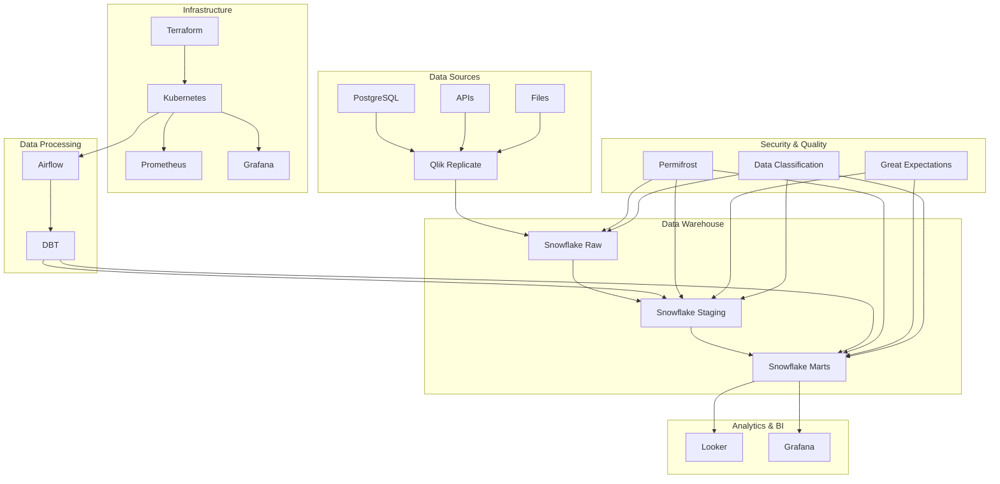

# System Architecture

## Overview

This document outlines the complete system architecture for the data engineering prototyping platform, including all components, data flows, and integration points.

## High-Level Architecture

## Component Details

### Data Ingestion Layer
- **Qlik Replicate**: Real-time data replication from source systems
- **Source Systems**: PostgreSQL, APIs, file systems
- **Data Formats**: Structured and semi-structured data

### Data Storage Layer
- **Snowflake Raw**: Landing zone for raw data
- **Snowflake Staging**: Cleaned and standardized data
- **Snowflake Marts**: Business-ready dimensional models

### Data Processing Layer
- **DBT**: Data transformation and modeling
- **Airflow**: Workflow orchestration and scheduling
- **Astronomer**: Managed Airflow platform

### Analytics Layer
- **Looker**: Business intelligence and analytics
- **Grafana**: Operational dashboards and monitoring
- **Custom Dashboards**: Business-specific visualizations

### Infrastructure Layer
- **Kubernetes**: Container orchestration
- **Terraform**: Infrastructure as Code
- **AWS**: Cloud infrastructure provider

### Security Layer
- **Permifrost**: Snowflake permissions management
- **Data Classification**: Data sensitivity management
- **PII Detection**: Personal data protection
- **Audit Logging**: Comprehensive audit trails

## Data Flow

### 1. Data Ingestion
1. Source systems generate data
2. Qlik Replicate captures changes
3. Data is replicated to Snowflake Raw schema
4. Replication status is monitored

### 2. Data Processing
1. Airflow triggers DBT models
2. Raw data is cleaned and standardized (Staging)
3. Business logic is applied (Marts)
4. Data quality tests are executed
5. Results are validated and logged

### 3. Data Consumption
1. Looker connects to Snowflake Marts
2. Business users create reports and dashboards
3. Grafana monitors system performance
4. Alerts are triggered for issues

### 4. Monitoring & Observability
1. Prometheus collects metrics
2. Grafana visualizes system health
3. Alerts notify of issues
4. Logs are aggregated and analyzed

## Security Architecture

### Data Classification
- **Level 1 (Public)**: No special handling
- **Level 2 (Internal)**: Employee access only
- **Level 3 (Confidential)**: Authorized personnel only
- **Level 4 (Restricted)**: Specific roles only

### Access Controls
- **Role-based Access**: Different roles for different functions
- **Data Masking**: PII protection in non-production
- **Audit Logging**: All access is logged and monitored
- **Encryption**: Data encrypted at rest and in transit

### Compliance
- **GDPR**: European data protection
- **CCPA**: California privacy rights
- **HIPAA**: Health information protection
- **PCI DSS**: Payment card security

## Performance Considerations

### Data Processing
- **Incremental Models**: Only process changed data
- **Warehouse Scaling**: Auto-scale based on workload
- **Query Optimization**: Efficient SQL patterns
- **Caching**: Strategic use of caches

### Monitoring
- **Real-time Metrics**: Live system monitoring
- **Alerting**: Proactive issue detection
- **Capacity Planning**: Resource usage tracking
- **Performance Tuning**: Continuous optimization

## Scalability

### Horizontal Scaling
- **Kubernetes**: Auto-scaling containers
- **Airflow**: Multiple workers
- **DBT**: Parallel model execution
- **Snowflake**: Multi-cluster warehouses

### Vertical Scaling
- **Container Resources**: CPU and memory scaling
- **Warehouse Sizes**: Snowflake compute scaling
- **Storage**: Elastic storage growth
- **Network**: Bandwidth optimization

## Disaster Recovery

### Backup Strategy
- **Data Backups**: Regular Snowflake backups
- **Code Backups**: Git repository replication
- **Configuration Backups**: Infrastructure state backup
- **Monitoring Backups**: Alert and dashboard backup

### Recovery Procedures
- **RTO (Recovery Time Objective)**: 4 hours
- **RPO (Recovery Point Objective)**: 1 hour
- **Failover Procedures**: Automated failover
- **Testing**: Regular disaster recovery tests

## Cost Optimization

### Resource Management
- **Auto-suspend**: Inactive resource suspension
- **Right-sizing**: Appropriate resource allocation
- **Reserved Instances**: Cost-effective compute
- **Storage Optimization**: Data lifecycle management

### Monitoring
- **Cost Tracking**: Real-time cost monitoring
- **Budget Alerts**: Cost threshold notifications
- **Optimization Recommendations**: Automated suggestions
- **Regular Reviews**: Monthly cost analysis

## Maintenance

### Regular Tasks
- **Security Updates**: Monthly security patches
- **Dependency Updates**: Quarterly dependency updates
- **Performance Reviews**: Monthly performance analysis
- **Capacity Planning**: Quarterly capacity reviews

### Monitoring
- **Health Checks**: Continuous system monitoring
- **Alert Management**: Proactive issue resolution
- **Log Analysis**: Regular log review
- **User Feedback**: Continuous improvement

## Future Enhancements

### Planned Features
- **Machine Learning**: ML model integration
- **Real-time Analytics**: Stream processing
- **Advanced Security**: Zero-trust architecture
- **Cost Optimization**: AI-driven optimization

### Technology Evolution
- **New Tools**: Emerging technology adoption
- **Cloud Native**: Full cloud-native architecture
- **Automation**: Increased automation
- **AI Integration**: Artificial intelligence integration
